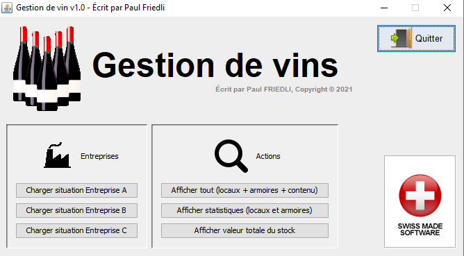

# Exercice 11 : Vins Et Spiritueux
## durée : 240'
## Objectifs visés :
Maîtrise de MVC ; Maitriser les diagrammes de séquence ; Maitriser les diagrammes de classes ; Savoir se référer à la Javadoc.

## Travail à réaliser
Lisez avec attention les informations fournies ci-après sous diverses formes (diagramme de classe, javadoc, diagrammes de séquence, …) car vous y trouverez toutes les informations utiles afin de finaliser le projet Java « **VinsEtSpiritueux** ».

## Résultat à obtenir
Si votre code est correctement implémenté selon les directives reçues, vous devriez obtenir une application fonctionnelle ressemblant à cela :



## Fonctionnalités de l’application
Trois boutons permettent de charger les trois configurations différentes de trois entreprises distinctes :

| Entreprises | Locaux | Armoires | Bouteilles |
|:---|:---|:---:|:---|
|A|Salle A01|A01A|Leroy Chambertin Grand Cru de 2003 / 3 900,00 Frs<br>Montrachet Grand Cru de 2004 / 1 499,00 Frs<br>Château Lafite-Rothschild de 2006 / 989,50 Frs|
|A|Salle A01|A01B|Romanée Conti Grand Cru de 2001 / 14 000,00 Frs<br>Romanee-Conti Montrachet Grand Cru de 2004 / 5 100,00 Frs<br>Petrus de 2005 / 2 350,00 Frs|
|B|Cave en pierre|C-01|Montrachet Grand Cru de 2004 / 1 499,00 Frs<br>Château Lafite-Rothschild de 2006 / 989,50 Frs<br>Romanée Conti Grand Cru de 2001 / 14 000,00 Frs<br>Petrus de 2005 / 2 350,00 Frs|
|B|Halle de stockage|H-01|Dôle de Salquenen de 2010 / 39,90 Frs<br>Dôle blanche de 2019 / 29,90 Frs<br>Malvoisie de 2018 / 24,90 Frs|
|B|Halle de stockage|H-02|Pinot noir de 2016 / 19,90 Frs|
|C|(vide)|(vide)|(vide)|


**Autres boutons** :
Trois autres boutons permettent d’afficher différentes informations sur l’entreprise actuellement chargée. Pour l’entreprise B, l’utilisation de ces boutons vous affichera les informations ci-dessous sur la console :


```
=======================
Contenu du local : Cave en pierre
  Armoire : C-01
    Montrachet Grand Cru de 2004 / 1 499,00 Frs
    Château Lafite-Rothschild de 2006 / 989,50 Frs
    Romanée Conti Grand Cru de 2001 / 14 000,00 Frs
    Petrus de 2005 / 2 350,00 Frs
Contenu du local : Halle de stockage
  Armoire : H-01
    Dôle de Salquenen de 2010 / 39,90 Frs
    Dôle blanche de 2019 / 29,90 Frs
    Malvoisie de 2018 / 24,90 Frs
  Armoire : H-02
    Pinot noir de 2016 / 19,90 Frs
=======================
```
---

```
Statistiques du local : Cave en pierre
 => plus cher   : Romanée Conti Grand Cru de 2001 / 14 000,00 Frs
 => moins cher  : Château Lafite-Rothschild de 2006 / 989,50 Frs
 => Nbre        : 4
 => Prix moyen  : 4709.625
  Statistiques de l'armoire : C-01
   => plus cher   : Romanée Conti Grand Cru de 2001 / 14 000,00 Frs
   => moins cher  : Château Lafite-Rothschild de 2006 / 989,50 Frs
   => Nbre        : 4
   => Prix moyen  : 4709.625
Statistiques du local : Halle de stockage
 => plus cher   : Dôle de Salquenen de 2010 / 39,90 Frs
 => moins cher  : Pinot noir de 2016 / 19,90 Frs
 => Nbre        : 4
 => Prix moyen  : 28.65
  Statistiques de l'armoire : H-01
   => plus cher   : Dôle de Salquenen de 2010 / 39,90 Frs
   => moins cher  : Malvoisie de 2018 / 24,90 Frs
   => Nbre        : 3
   => Prix moyen  : 31.566666666666663
  Statistiques de l'armoire : H-02
   => plus cher   : Pinot noir de 2016 / 19,90 Frs
   => moins cher  : Pinot noir de 2016 / 19,90 Frs
   => Nbre        : 1
   => Prix moyen  : 19.9
```
---
 
```
=======================
Valeur totale du stock 
=======================
Local : Cave en pierre => 18 838,50 Frs
Local : Halle de stockage => 114,60 Frs
-----------------------
Total : 18 953,10 Frs
=======================

```

## Diagramme de classes


## Diagramme de classes : les modèles


### Structure des packages Java
Voici la structure des packages pour chaque classe du projet

### Diagramme de séquence
Voici le diagramme de séquence de la méthode de la méthode `main()` de la classe `Application` du package `app` :

### Javadoc
Vous pouvez cliquer sur [ce lien pour obtenir la JavaDoc en HTML](javadoc/index.html) de l'application **VinsEtSpiritueux**.
